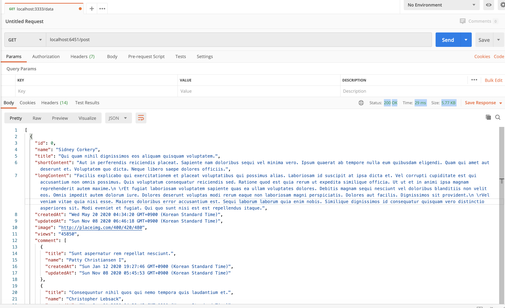

# SOO Dummy Server
**더미 데이터 생성**과 **REST API Mock 서버**를 쉽게 구축하여 **샘플용 API**가 필요한 경우에 사용할 수 있는 프로젝트 입니다.   
이를 구현하기 위해  `faker.js`와 `json-server.js` 라이브러리를 사용 했습니다. 기존에 이 두 라이브러리를 결합해서 사용할 경우에 필요한 boilerplate 코드들을 줄이기 위해서 만든 프로젝트 입니다.

## 왜 만들었나?
백엔드 API 개발이 안된 상태에서 UI 개발을 위한 더미 DB 데이터와, 이를 이용할 수 있는 REST API 가 필요한 경우. 그리고, 대량의 더미 데이터를 이용한 렌더링 성능 테스트에 사용하기 위해 만들었습니다.                         
해당 더미 서버로 UI 작업을 하신 후에 백엔드 API가 완성되면, API 호출 주소만 바꿔주시면 됩니다.  

## 적용 라이브러리
- [faker.js](https://github.com/marak/Faker.js)
- [json-server.js](https://github.com/typicode/json-server)

## 설치
```shell script
$ git clone https://github.com/SooJae/soo.dummy-server.git
$ yarn install
```

## 실행
index.js에 더미 샘플 값이 있습니다.
```shell script
$ node index.js  // 더미데이터가 들어있는 data.json 생성
$ npm start // json-server 실행
``` 

기본 json-server 주소: [http://localhost:6451](http://localhost:6451)

## 데이터 모델 생성 
### 모델 예시
```js
const post = {
  id: 'id',
  name: 'name.findName',
  title: 'lorem.sentence',
  shortContent: 'lorem.paragraph',
  longContent: 'lorem.paragraphs(3)',
  createdAt: 'date.past',
  updatedAt: 'date.recent',
  image: 'image.imageUrl(400/420)',
  views: 'random.number',
  comment: [{
    title: 'lorem.sentence',
    name: 'name.findName',
    createdAt: 'date.past',
    updatedAt: 'date.recent',
  }, 4],
  avatar: {
    id: 'random.uuid',
    name: 'name.findName',
    avatar:'image.avatar'
  }
}
```

데이터 모델은 객체 생성 방식으로 되어있습니다.    
key 값은 사용자가 사용할 프로퍼티 값으로 지정하고, value 값은 [faker.js](https://github.com/marak/Faker.js/#api-methods) 페이지에 있는 API 메소드 값을 이용하시면 됩니다.  

**데이터 인덱스 값(0부터 시작되는 값)**: value 값을 `id`로 지정해주시면 됩니다. (모델 예시에 있는 `id`)      
**배열 데이터의 갯수 지정**: 배열의 2번째 인덱스에 원하시는 배열의 갯수를 적어주시면 됩니다. (모델 예시에 있는 `comment`)  

### 모델 생성 함수 호출
```js
generator(post, 2, 'post'); 
// generator(모델의 변수값, 데이터 갯수, REST API 호출시 주소 경로)
```
`data.json` 파일에 `post` 이외에 `user`라는 데이터도 추가 하고 싶으시다면 다음과 같이 함수를 추가로 호출 하시면 됩니다. 
```js
generator(post, 2, 'post');
generator(user, 3, 'user');
```

## 데이터 호출


GET 외에 더 많은 API 메소드와 옵션은 [json-server API](https://github.com/typicode/json-server) 에서 확인 할 수 있습니다.
